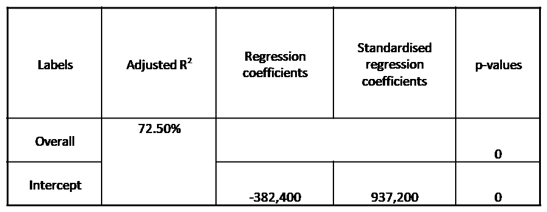
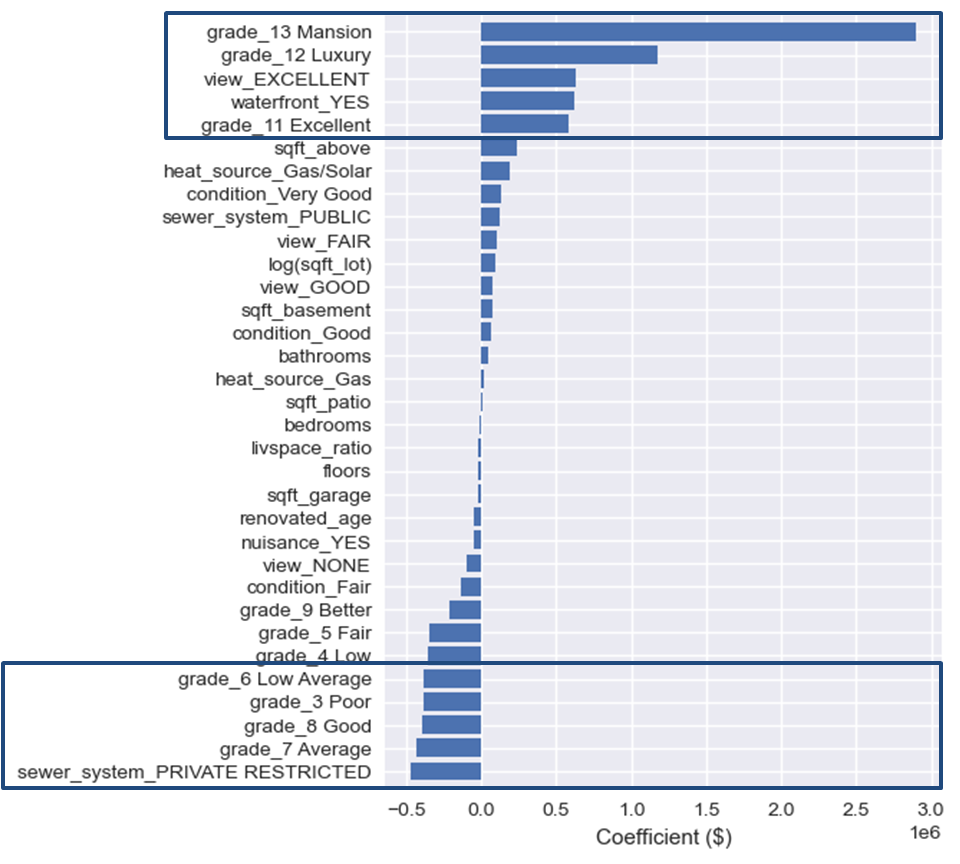
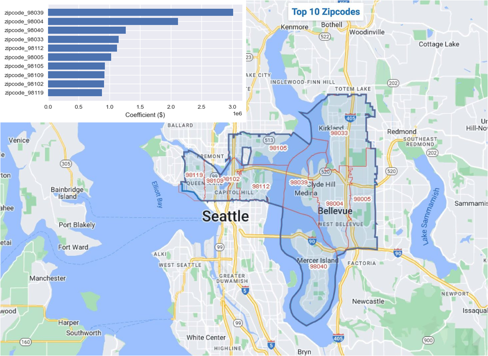

# Real Estate Analysis
## Business Understanding
Real estate investing involves purchase, management and sale or rental of real estate for profit. Property evaluation is preliminary step for real estate investment. This invloves evaluating the property location, physical features of property, the history of property.

King County is located in Washington State. The population was 2,269,675 in the 2020 census, making it the most populous county in Washington, and the 13th-most populous in the United States. The county seat is Seattle, also the state's most populous city. There are current 8 fortune 500 companies' head quarters, such as Amazon, Microsoft, Costco, Starbucks, etc,  are located in King County. These factors make King County a very active market for real estate investment.

Fisher Real Estate Investments wants to invest properties in King County. As preliminary evaluation, we wants to understand the most influential physical features of the houses that affect the price of the houses in King County real estate market. 

## Data Understanding
- The dataset contains more than 30k houses data for 2021-2022 home sales in King County, Washington.
- The data includes the house sale price, address, physical features, such as lot size, house size, bedrooms, bathrooms, grade, etc
### Baseline Model
After data cleaning, a linear regression baseline model is constructed

**interpretate baseline model**
- We define the alpha value is 0.05 in this report
- The baseline model is overall statistically significant. The model explains 42% variance in the sale price of king county houses
- The intercept and most coefficients of the numeric predictors, except the lot sqft, are statistically significant
### Model Iteration

**Create new features**
- create age, renovated_age and living space ratio features
- By creating new features, the model didn't improve.
- The model is overall statistically significant

**Add categorical predictors to the model**
- After adding categorical predictors to the model, the model is still overall statistically significant
- We improved the model and now the model explains around 69% variance in the sale price

**Handle outliers**
- The data may contains outliers that could affect the performance of the model
- By removing the outliers from bedrooms, bathrooms and floors predictors, the model improves
- The model is still overall statistically significant and explains 72.6% variance in sale price

**Multicollinearity of predictors**
- There are several features are highly correlated.
- By removing one feature from each hightly correlated pair, however, our model does not improve.
- Although it does not improve out model, We will remove one feature from each of the highly correlated pair

**Data transformation**
- By transforming sqft_lot and livspace_ratio to logarithm values, our model marginally improves
- Now our model explains about 73% variance in price
### Regression diagnostics
- Linearity
- Multicollinearity of features
- Normality
- Homosecdasticity

**Linearity**
- Rainbow test
    - Our final model has p value of around 1 for rainbow test, so we failed to reject null hypothesis at an alpha of 0.05. This means we consider the relationship to be linear.

**Multicollinearity**
- From above model iteration, we identified three pairs of predictors are highly correlated. Those pairs are (renovated_age, age), (sqft_above, sqft_living) and (bathrooms, sqft_living)
- Our final model included these pairs since removing those features did not improve our model performance

**Normality**
- Jarque-Bera test
    - Our model summary reports the p value for Jarque-Bera test is close to 0, so we reject the null hypothesis at an alpha of 0.05. This means we do not consider the distribution to be normal.

**Homosecdasticity**
- Goldfeld-Quandt Test
    - The p value of Goldfeld_Quant test is 0.00000006, so we rejected null hypothesis at an alpha of 0.05. This means that we consider the data to be heterosecdastic
## Regression Results
- The multiple linear regression model uses sale price as target and various house features as predictors
- The model overall is statistically significant and can explain about 72.5% variance in sale price
- The intercept and most predictors are statistically significant

### The features that are most important to sale price
- The top 5 positive influential features on the sale price of a house are the houses are mansion, luxury or excellent overall grade (grade 11 or above) compared to very good grade (grade 10), has waterfront and excellent view.
- The top 5 negative influential features on the sale price of a house are the houses are poor, low average, average, good grade, compared to very goode grade(grade 10), and has private restricted sewer system.

- The top 10 zipcodes that are most important to sale price are 98119, 98102, 98109, 98105, 98005, 98112, 98033, 98040, 98004, 98039
  - These top 10 zipcodes can be shown in the [map](https://www.randymajors.com/p/customgmap.html?zips=98119,98102,98109,98105,98005,98112,98033,98040,98004,98039&zipboundary=show&title=Top+10+Zipcodes)

## Conclusion
This analysis provides the following recommandations to Fisher Real Estate Investemnts when evaluating the most price-impact features of housing in King County market:
- **Location**. The top ten coefficients for zipcodes that are most influential on sale price range from about \\$880K to about \\$3,010K.
- **Great Physical features**. The price of the house will be positively impacted by those with overall high grades (excellent, luxury and mansion), excellent view and on waterfront.
- **Poor Physical features**. The price of the house will be negatively impacted by those with overall lower grades and private restricted sewer system.
## Next Steps:
- Source addition data such as perceived safety of a neighborhood and the number of services or amenities nearby. These could include data from safety records, walkability of the house, nearby major transit stations, nearby hospitals, nearby schools.
